# MySehat


## About this Project

MySehat is a Laravel-based web application created as a web development final project to digitize core hospital workflows and connect Admins, Doctors, and Patients on a single platform. The UI/UX is intentionally minimalist due to time constraints, prioritizing clarity and quick iteration. The backend is fully implemented and functional — authentication, role-based features, CRUD operations, migrations, and seeders are in place. Deployment was considered but not pursued for this demo repository since it has no active users; it's ready to be deployed if you want to run it live or extend it further.


## 🌟 Key Features

The application features three main user roles with tailored functionalities for each:

### 👑 Admin

  * **Admin Dashboard:** View system summary statistics.
  * **User Management (CRUD):** Add, view, edit, and delete user data (Doctors, Patients, other Admins).
  * **Medicine Management (CRUD):** Manage the list of available medicines in the hospital.
  * **View Feedback:** Read and manage feedback submitted by patients.

### 🩺 Doctor

  * **Doctor Dashboard:** View upcoming consultation schedules and patient lists.
  * **Patient List:** View all patients registered in the system.
  * **Medical Record Management (CRUD):** Create, read, update, and delete medical records for patients.
  * **Consultation Schedule Management:** Confirm or decline consultation requests from patients.

### 👤 Patient

  * **Patient Dashboard:** View personal medical history and upcoming consultation schedules.
  * **Consultation Scheduling (CRUD):** Create, manage, and cancel appointments with available doctors.
  * **View Medical Records:** Access personal medical history.
  * **Provide Feedback:** Submit feedback or complaints regarding hospital services.

-----

## 🖼️ Gallery & Key Screenshots


### Landing / Entry

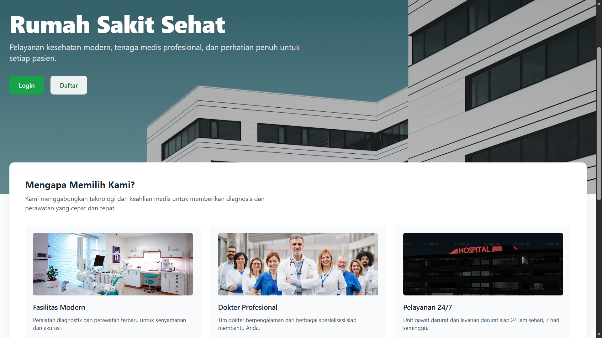

### Login & Registration

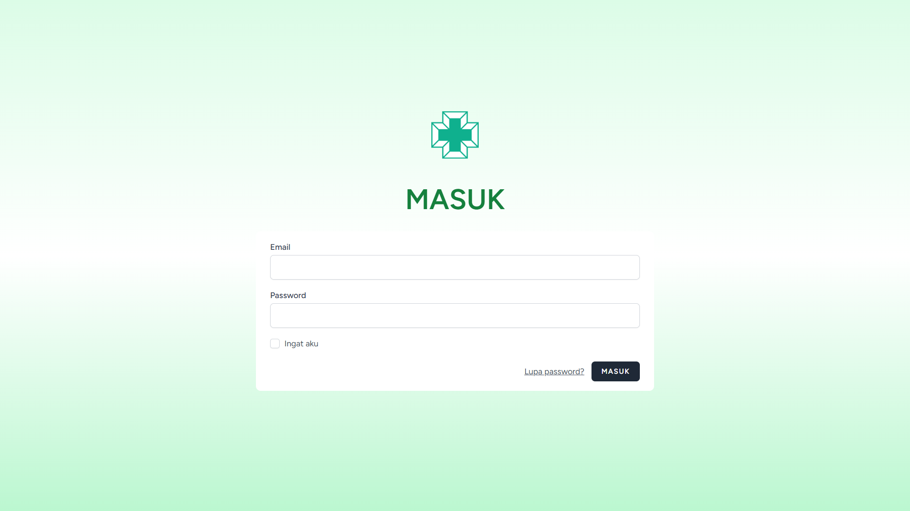


### Role-Based Dashboards

| Admin | Doctor | Patient |
|:---:|:---:|:---:|
| 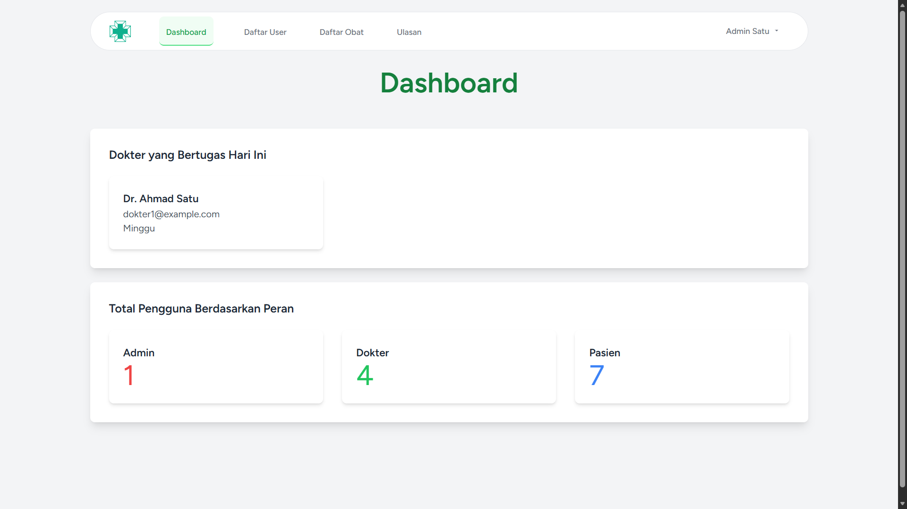 | 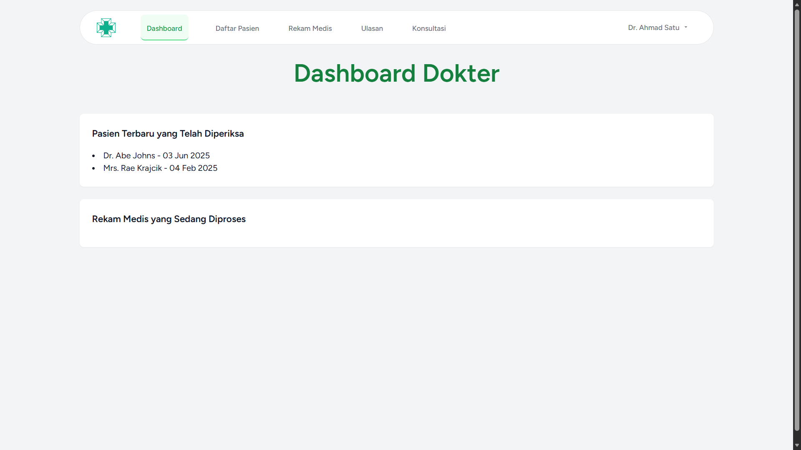 | 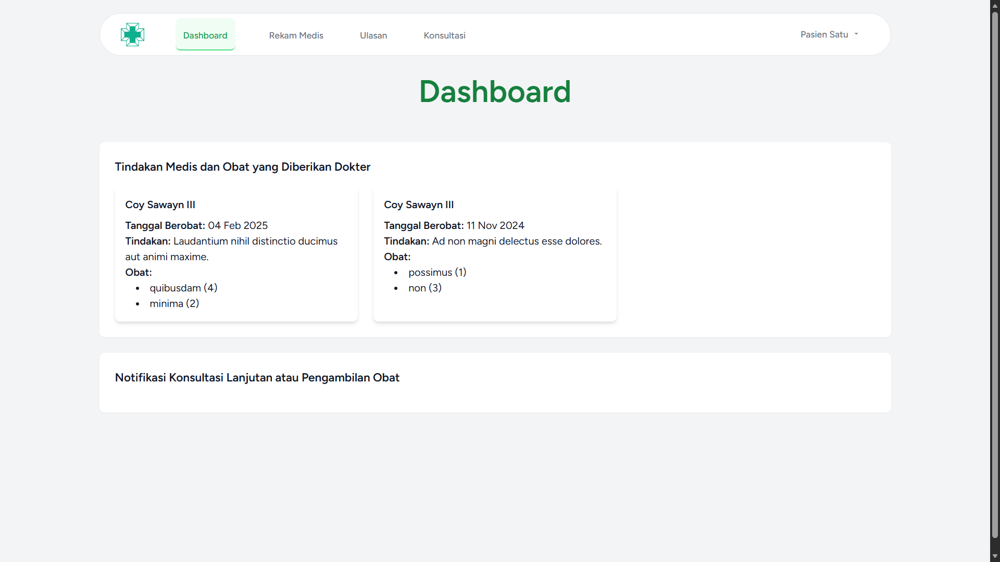 |

### Admin — Core Screens

| Users (DB) | Medicines | Feedback |
|:---:|:---:|:---:|
| 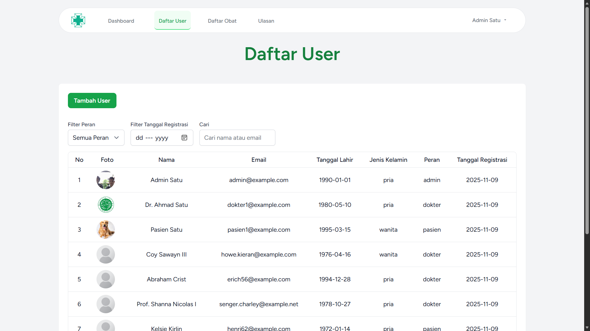 | 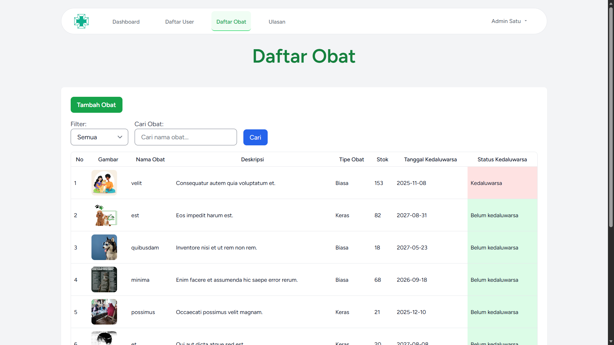 | 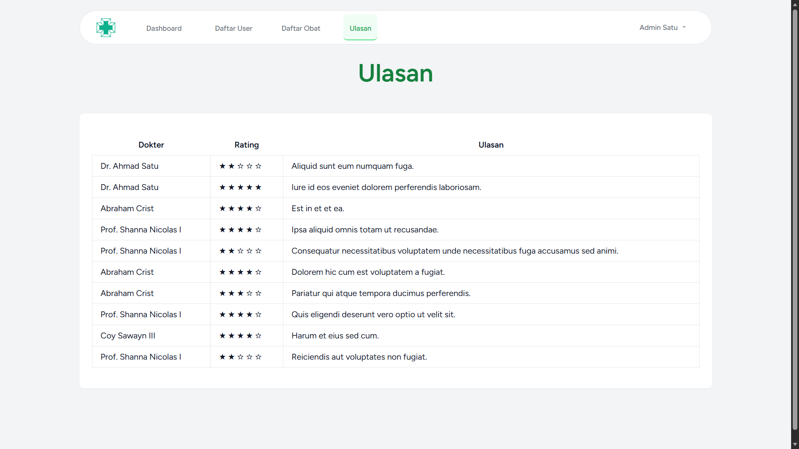 |

### Doctor — Core Screens

| Patients | Medical Records | Consultations |
|:---:|:---:|:---:|
| 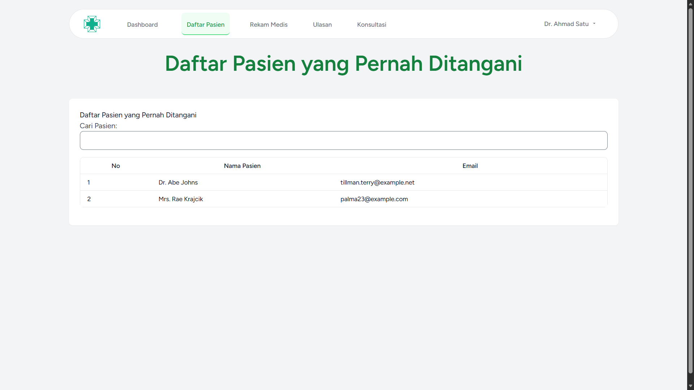 | 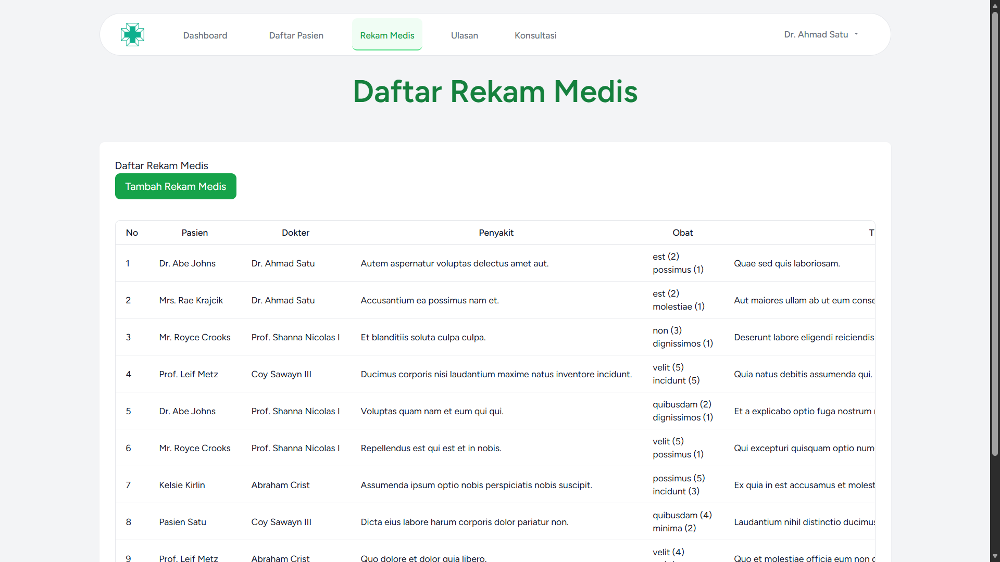 | 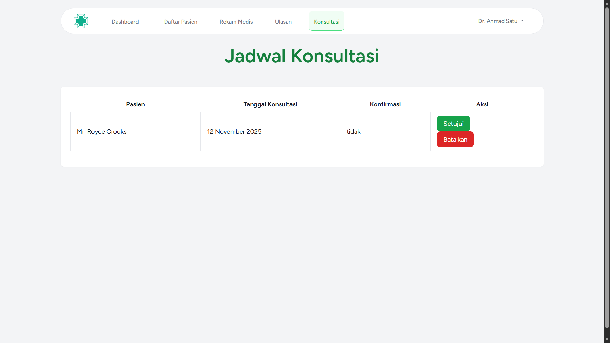 |

### Patient — Core Screens

| Dashboard | Book Consultation | Medical Records / Feedback |
|:---:|:---:|:---:|
|  | 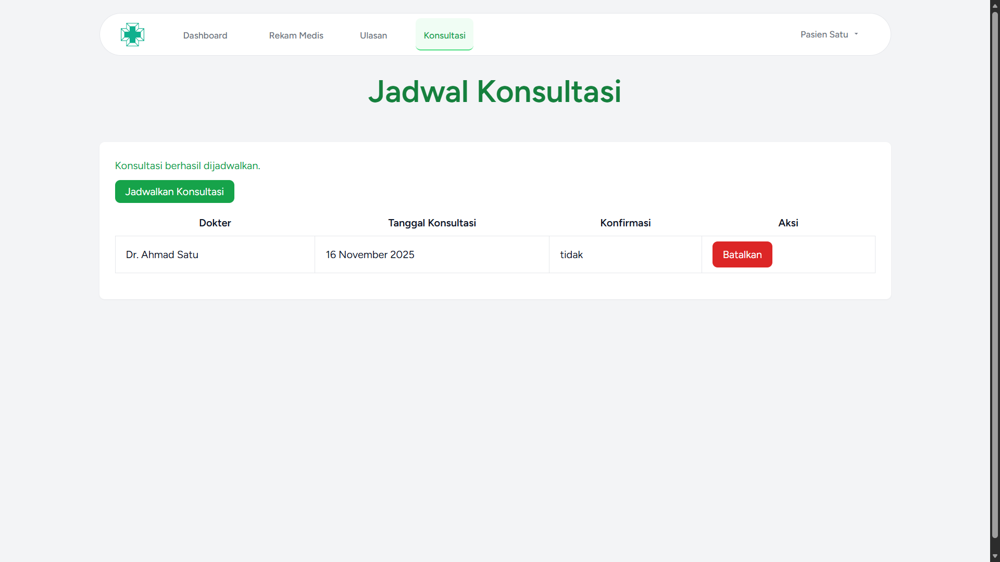 | 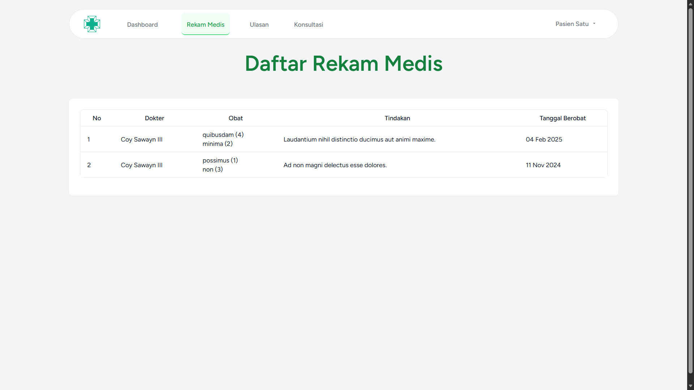 |

### Extra / Feedback

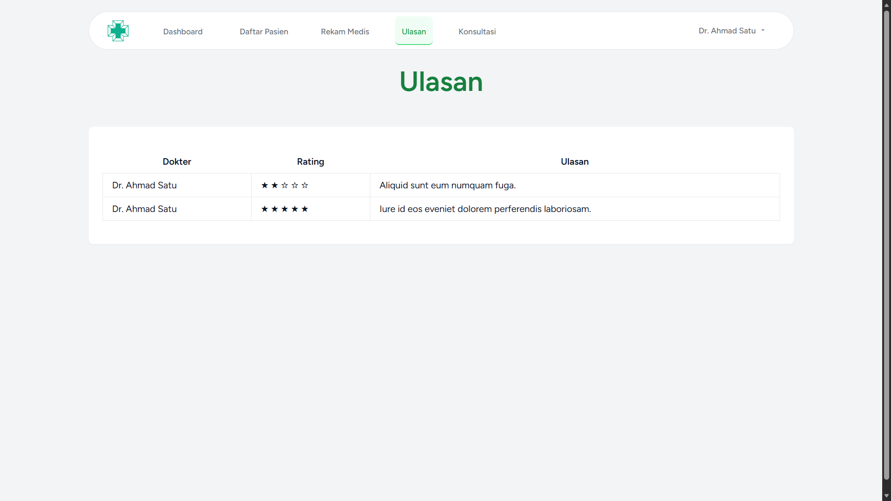
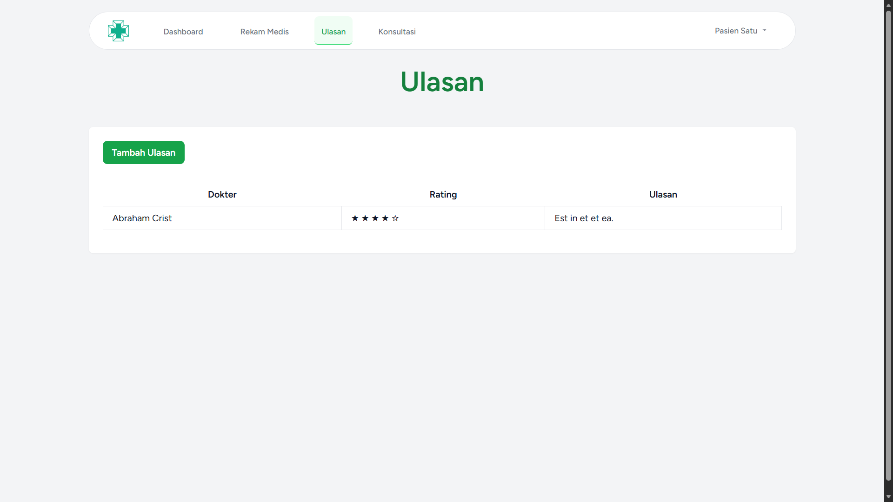


-----
## 🛠️ Tech Stack

Backend  
[](https://www.php.net/) [](https://laravel.com/)

Frontend  
[](https://tailwindcss.com/) [](https://laravel.com/docs/blade) [](https://vitejs.dev/)

Database  
[](https://www.mysql.com/)

Authentication  
[](https://laravel.com/docs/starter-kits#laravel-breeze)

Architecture  
[](https://en.wikipedia.org/wiki/Model%E2%80%93view%E2%80%93controller)

-----

## 🚀 Getting Started (Installation)

Follow these steps to run the project locally:

1.  **Clone the Repository**

    ```bash
    git clone https://github.com/your-username/hospital-digitalization-system.git
    cd hospital-digitalization-system
    ```

2.  **Install Dependencies (Backend & Frontend)**

    ```bash
    composer install
    npm install
    ```

3.  **Setup Environment**

      * Copy the `.env.example` file to `.env`.
      * ```bash
          cp .env.example .env
        ```
      * Generate a new application key:
      * ```bash
          php artisan key:generate
        ```

4.  **Configure Database**

      * Create a new database in MySQL (e.g., `hospital_db`).
      * Set up your database connection in the `.env` file:

    <!-- end list -->

    ```
    DB_CONNECTION=mysql
    DB_HOST=127.0.0.1
    DB_PORT=3306
    DB_DATABASE=hospital_db
    DB_USERNAME=root
    DB_PASSWORD=
    ```

5.  **Run Database Migrations & Seeding**

      * Run migrations to create the tables.
      * Run the seeder to populate the database with initial data (including admin, doctor, and patient users).

    <!-- end list -->

    ```bash
    php artisan migrate --seed
    ```

    *(I saw you have a `UserSeeder.php`, so `--seed` is important\!)*

6.  **Run the Application**

      * Run the frontend asset build process (Vite):
      * ```bash
          npm run dev
        ```
      * In a separate terminal, serve the Laravel application:
      * ```bash
          php artisan serve
        ```

7.  **Access the Application**

      * Open [http://127.0.0.1:8000](https://www.google.com/search?q=http://127.0.0.1:8000) in your browser.
      * You can log in using the default accounts from `UserSeeder.php` (if configured).

-----